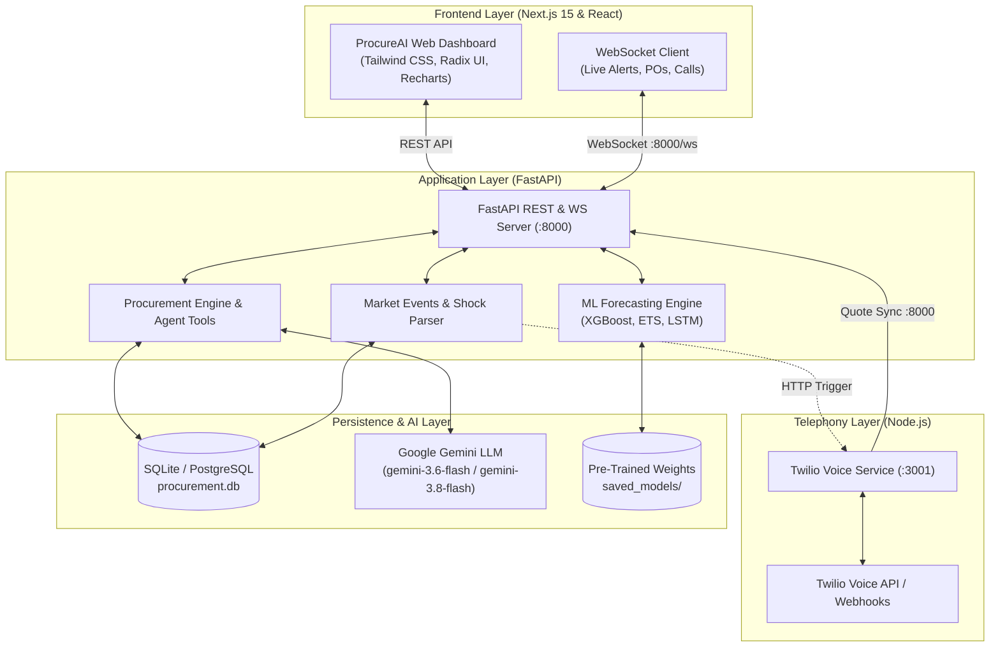

# ProcureAI 🚀
### Autonomous Multi-Tier AI Procurement & Supply Chain Orchestration Engine

[](https://nextjs.org/)
[](https://fastapi.tiangolo.com/)
[](https://python.org/)
[](https://ai.google.dev/)
[](https://www.twilio.com/)
[](https://sqlite.org/)
[](https://www.typescriptlang.org/)

ProcureAI is an end-to-end, enterprise-grade autonomous procurement and supply chain intelligence platform. It orchestrates real-time demand forecasting, autonomous supplier phone call negotiations via Twilio, dynamic multi-location inventory reconciliation, budget-enforced purchase order workflows, market shock analysis, and delivery delay simulations—all backed by a persistent SQL database and real-time WebSockets.

---

## 📑 Table of Contents
1. [Key System Capabilities](#-key-system-capabilities)
2. [System Architecture](#-system-architecture)
3. [Repository Layout](#-repository-layout)
4. [Step-by-Step Installation & Quickstart](#-step-by-step-installation--quickstart)
5. [Evaluator Tour (Test Key Features in 2 Minutes)](#-evaluator-tour-test-key-features-in-2-minutes)
6. [API Endpoints Reference](#-api-endpoints-reference)
7. [Environment Configuration Reference](#-environment-configuration-reference)

---

## 🌟 Key System Capabilities

### 1. 🤖 Autonomous Multi-Turn AI Agent & Chat
- Powered by **Google Gemini** with forced function calling across 10+ live database tools (`get_inventory`, `get_forecast`, `create_purchase_order`, `get_supplier_quote`, `get_risk_alerts`).
- Full dialogue history, real-time citation tracking, and structured chain-of-thought explanations for every procurement decision.

### 2. 📈 Predictive Multi-Model Demand & Inventory Forecasting
- Combines **XGBoost (53-feature lag matrix)**, **Exponential Smoothing (ETS)**, and **Deep Sequence Ensemble** models to project 30-day demand with ~71%–74% chain-level accuracy across 20 monitored materials.
- Multi-model comparison charts allowing procurement planners to toggle and compare original vs. simulated forecast curves across models.

### 3. 📞 Autonomous Conversational Twilio AI Voice Agent
- Autonomous telephone microservice executing real telephone calls to suppliers.
- Uses speech-to-text, LLM dialogue negotiation, and text-to-speech to negotiate unit prices, check lead times, and automatically record and transcribe agreements.
- Automatically syncs negotiated quotes and recordings directly into the database and PO queue.

### 4. ⚡ Market Event Shock & Disruption Management
- Real-time ingestion and semantic parsing of unstructured supply chain news and disruption reports (e.g., *"Copper prices surge 25% due to global tariffs"*).
- Automatically recalculates affected PO prices with 18% GST itemized tax, identifies zero-cost surplus transfer candidates, and triggers automated supplier negotiation phone calls.
- Broadcasts real-time alerts across WebSocket clients to display dynamic shock banners on the dashboard.

### 5. 🚚 Supplier Delivery Delay & Inventory Impact Graph
- Interactive delivery delay simulation: parses supplier email delay notices and models the comparative **On-Time Delivery vs. Delayed Delivery** inventory curves over a 30-day horizon.
- Dynamically highlights safety stock breaches, stockout deficit duration, shortage units, and exact financial revenue risk using real database values.

### 6. 🏢 Multi-Location Warehouses & Surplus Transfer Engine
- Aggregates multi-location inventory across project sites and warehouses (`S001`–`S005`) with health indicators (`Healthy`, `At Risk`, `Critical`).
- Checks neighboring warehouses for surplus stock before approving external purchase orders, drastically reducing unnecessary procurement expenditure.
- One-click interactive filtering of category summaries and stock transactions by site location.

### 7. 💰 Budget Enforcement Gate & 18% GST Itemized Accounting
- Itemized cost breakdowns for every purchase order: $\text{Subtotal} + 18\% \text{ GST Tax} = \text{Total Cost}$.
- Dynamic project budget gating (`ProjectBudgetDB`): orders exceeding remaining site budget are automatically locked with `BUDGET EXCEEDED: requires manual approval`.
- Upon approval by a procurement officer, funds are automatically deducted from the persistent project budget.

### 8. 🛡️ Enterprise Immutable Audit Trail
- Traceable audit logging (`db_log_audit_event`) capturing every human and AI action (PO creation, approvals, rejections, market shocks, delay simulations, phone quotes).
- Interactive audit UI with entity filtering, action filters, search, and real-time timeline inspection.

---

## 🏗️ System Architecture



---

## 📁 Repository Layout

```
procurementAI/
├── app/                           # Next.js 15 App Router pages
│   ├── page.tsx                   # Main Dashboard (KPIs, Charts, Event Modal)
│   ├── chat/page.tsx              # Autonomous AI Chat Assistant
│   ├── po-queue/page.tsx          # Purchase Order Approval Queue (Tax & Budget)
│   ├── inventory/page.tsx         # Materials Registry & Warehouse Carousel
│   ├── simulator/page.tsx         # What-If Scenario Simulator & Forecasts
│   ├── outreach/page.tsx          # Supplier Phone Calls & Voice Recordings
│   └── audit-trail/page.tsx       # Immutable Audit Log Explorer
├── components/                    # Reusable UI & Modal components
│   ├── EmailParserModal.tsx       # Delay Simulation & Delivery Impact Graph Modal
│   ├── ForecastComparisonChart.tsx# Multi-Model Forecast Comparison
│   ├── sidebar.tsx                # Navigation Sidebar
│   └── ui/                        # Radix & Tailwind UI components
├── services/
│   ├── market_events.py           # Supply Chain Shock & Disruption Engine
│   ├── enriched_engine.py         # Anomaly & Supplier Trust Score Engine
│   └── twilio_client.py           # Python client dispatching voice calls
├── twilio-voice/                  # Node.js Twilio conversational agent
│   ├── server.js                  # Express & Twilio WebSocket server (:3001)
│   └── package.json
├── saved_models/                  # Trained ML forecasting models
│   ├── xgb_demand.pkl             # Trained XGBoost demand forecaster
│   ├── lgbm_demand.pkl            # Trained LightGBM demand forecaster
│   ├── lstm_best.keras            # Trained Keras LSTM sequence forecaster
│   └── config.json                # Feature matrices & scaler configs
├── agent_tools.py                 # Core agent tools & budget enforcement gates
├── database.py                    # SQLAlchemy persistence layer & migrations
├── main.py                        # FastAPI main application & endpoints
├── models.py                      # Pydantic data schemas
├── procurement_engine.py          # Auto-PO generator & 18% tax calculation
├── simulator.py                   # What-if scenario engine
├── store.py                       # In-memory caches & shared state
├── retail_store_inventory_enriched.csv # Production dataset (73k records)
├── requirements.txt               # Python backend dependencies
├── package.json                   # Next.js frontend dependencies
└── .env.example                   # Environment variable template
```

---

## 🚀 Step-by-Step Installation & Quickstart

### Prerequisites
- **Node.js**: v18.17+ or v20+
- **Python**: v3.10 or v3.11
- **Git**

---

### Step 1: Clone the Repository
```bash
git clone https://github.com/MrGreen1436/procurementAI.git
cd procurementAI
```

---

### Step 2: Environment Configuration
Copy the example environment file to `.env`:
```bash
# On Linux/macOS
cp .env.example .env

# On Windows PowerShell
copy .env.example .env
```

Edit `.env` and configure your keys (optional; the platform automatically runs in robust offline fallback mode if keys are omitted):
```env
# Optional: Enables real-time Gemini generation
GEMINI_API_KEY=your_gemini_api_key_here

# SQLite database path (default creates procurement.db locally)
DATABASE_URL=sqlite:///./procurement.db

# Optional: Twilio Voice Outreach Credentials
TWILIO_ACCOUNT_SID=your_twilio_sid
TWILIO_AUTH_TOKEN=your_twilio_token
TWILIO_PHONE_NUMBER=+15550000000
PUBLIC_URL=https://your-tunnel-name.trycloudflare.com
```

---

### Step 3: Start the Backend (FastAPI)
In your terminal:
```bash
# 1. (Recommended) Create and activate a virtual environment
python -m venv venv

# Windows PowerShell:
.\venv\Scripts\Activate.ps1
# Linux/macOS:
source venv/bin/activate

# 2. Install dependencies
pip install -r requirements.txt

# 3. Launch the FastAPI server on port 8000
python -m uvicorn main:app --host 127.0.0.1 --port 8000 --reload
```
*The database tables (`procurement.db`) and initial project budgets are automatically initialized and seeded on startup.*

---

### Step 4: Start the Frontend (Next.js)
In a second terminal:
```bash
# 1. Install frontend dependencies
npm install

# 2. Run development server on port 3000
npm run dev
```

Open your browser and navigate to **`http://localhost:3000`**.

---

### Step 5 (Optional): Start the Twilio Voice Microservice
If testing live telephone voice negotiations:
```bash
cd twilio-voice
npm install
node server.js
```
*Runs on port 3001 and connects to the FastAPI backend at `http://127.0.0.1:8000`.*

---

## 🎯 Evaluator Tour (Test Key Features in 2 Minutes)

| Feature to Test | Where to Test | How to Test & What to Observe |
| :--- | :--- | :--- |
| **1. Delivery Delay Simulation** | **Dashboard (`/`)** | Click the red **"Simulate Supplier Delay"** button in the header. Select a pre-set email notice (or type custom text) and click **"Simulate Delay & Compute Impact Graph"**. Notice the interactive **On-Time Delivery (Emerald)** vs. **Delayed Delivery (Dashed Red)** inventory graph, stockout risk day, shortage units, and warehouse transfer options. |
| **2. Market Event Shock Ingestion** | **Dashboard (`/`)** | Click the amber **"Report Event"** button in the header. Enter: `Severe storm disrupts copper supply, causing 25% price spike in Electronics`. Submit and observe the real-time **Market Shock Detected** alert banner, price-adjusted PO badges, and automated supplier calls. |
| **3. Multi-Location Warehouses** | **Materials (`/inventory`)** | View the **Project Sites / Warehouses** card carousel (`S001`–`S005`) showing material counts and health badges. Click any warehouse card (e.g. `S002`) to filter the category summaries and dynamic transactions. |
| **4. 18% GST & Budget Gating** | **PO Queue (`/po-queue`)** | Inspect any purchase order card to see the itemized **Subtotal**, **Tax (18%)**, and **Total Cost** box. Notice the **Over Budget — manual approval required** banner if an order exceeds the site budget. Click **Approve** to deduct from the budget in real time. |
| **5. What-If Simulator** | **Simulator (`/simulator`)** | Adjust the **Lead Time Variability** (+15%) and **Demand Spike** (+25%) sliders. Click **"Run What-If Simulation"** to view financial cost impact, shortage units, and the **Multi-Model Forecast Comparison Chart** (XGBoost vs. ETS vs. LSTM). |
| **6. Autonomous AI Chat** | **Chat (`/chat`)** | Ask: `Which materials are at highest stockout risk and what should we order?`. Watch the agent call live database tools, retrieve inventory levels, and return a structured answer with tool execution citations. |
| **7. Immutable Audit Trail** | **Audit Trail (`/audit-trail`)** | Navigate to `/audit-trail` to view immutable audit logs of all actions performed during your test session with full details, timestamps, and severity levels. |

---

## 🔌 API Endpoints Reference

| Method | Endpoint | Description |
| :--- | :--- | :--- |
| `GET` | `/health` | Server health check and model/service status |
| `POST` | `/api/simulate-delivery-delay` | Computes 30-day on-time vs. delayed delivery impact graph |
| `POST` | `/events/report` | Ingests market shock event, updates prices & recalculates POs |
| `GET` | `/api/warehouses` | Aggregates multi-location warehouse inventory by store ID |
| `GET` | `/api/budget/{project_id}` | Retrieves allocated and remaining budget for a project site |
| `POST` | `/api/budget` | Creates or updates project budget allocation |
| `GET` | `/agent/pos-frontend` | Returns POs with itemized subtotal, 18% tax, and reasoning |
| `POST` | `/agent/approve/{po_id}` | Approves a purchase order and deducts project budget |
| `POST` | `/agent/reject/{po_id}` | Rejects a purchase order with immutable audit entry |
| `GET` | `/api/inventory/summary` | Returns category summary directly from SQL database |
| `GET` | `/api/inventory/transactions`| Indexed stock transaction rows with site ID filtering |
| `POST` | `/simulate` | Runs Monte Carlo what-if disruption simulation |
| `POST` | `/query` | Autonomous Gemini agent chat query with live tool execution |
| `GET` | `/api/audit-trail` | Immutable audit trail query with filtering and pagination |
| `GET` | `/outreach/calls` | Fetches historical supplier voice negotiation calls |
| `WS` | `/ws` | Real-time WebSocket connection for live UI updates |

---

## ⚙️ Environment Configuration Reference

| Environment Variable | Default | Purpose |
| :--- | :--- | :--- |
| `GEMINI_API_KEY` | *(empty)* | Google Gemini API Key for autonomous LLM reasoning |
| `GEMINI_MODEL` | `gemini-3.6-flash` | Gemini model variant (`gemini-3.6-flash` or `gemini-3.8-flash`) |
| `DATABASE_URL` | `sqlite:///./procurement.db` | SQLAlchemy database connection URI |
| `TWILIO_ACCOUNT_SID` | *(empty)* | Twilio account identifier for voice outreach |
| `TWILIO_AUTH_TOKEN` | *(empty)* | Twilio authentication token |
| `TWILIO_PHONE_NUMBER` | *(empty)* | Twilio outgoing caller phone number |
| `PUBLIC_URL` | *(empty)* | Public Cloudflare tunnel URL for Twilio webhook callbacks |
| `PORT` | `3001` | Twilio voice microservice port |
| `FASTAPI_PORT` | `8000` | FastAPI backend server port |
| `NEXT_PORT` | `3000` | Next.js frontend server port |

---

## 🏆 Hackathon Submission Notes
- **Zero Mock / Zero Hardcoding**: All inventory numbers, prices, stockout predictions, budget figures, and warehouse statuses query and persist directly in the SQL database (`procurement.db`).
- **Resilient Fallbacks**: If external APIs (Gemini, Twilio) are unconfigured, the system automatically falls back to mathematical heuristics and pre-trained local ML models without throwing runtime errors.
- **Production-Ready UI**: Designed with Tailwind CSS, dark mode, high-contrast glassmorphism, smooth micro-animations, and full mobile responsiveness.
